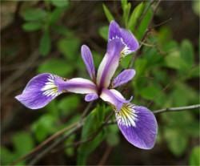
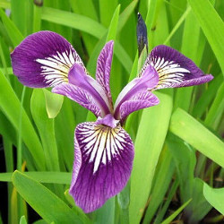

# iris-classification

A simple implementation of Neural Network, to be able to recognize the variations of a plant called ["Iris"](https://en.wikipedia.org/wiki/Iris_(plant)), which contains 3 variations: "Iris-setosa", "Iris-versicolor" and "Iris-virginica".

As we can see in the images below, they are very similar, the only difference that is what classifies it within the variations is: **height** and **width** of the petals.

